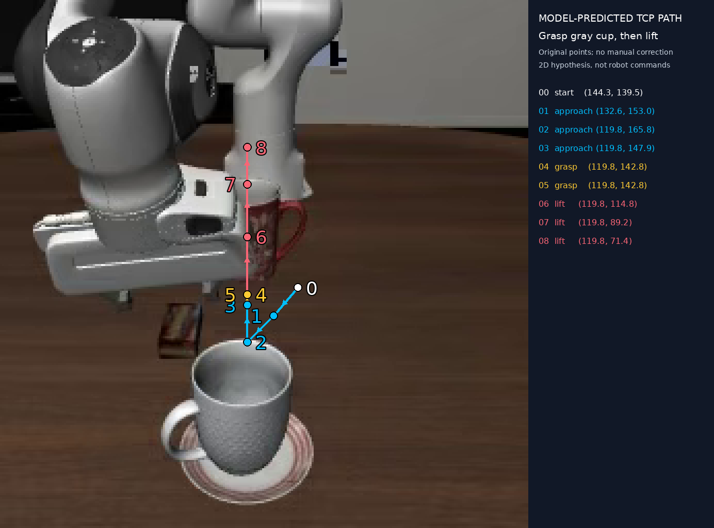
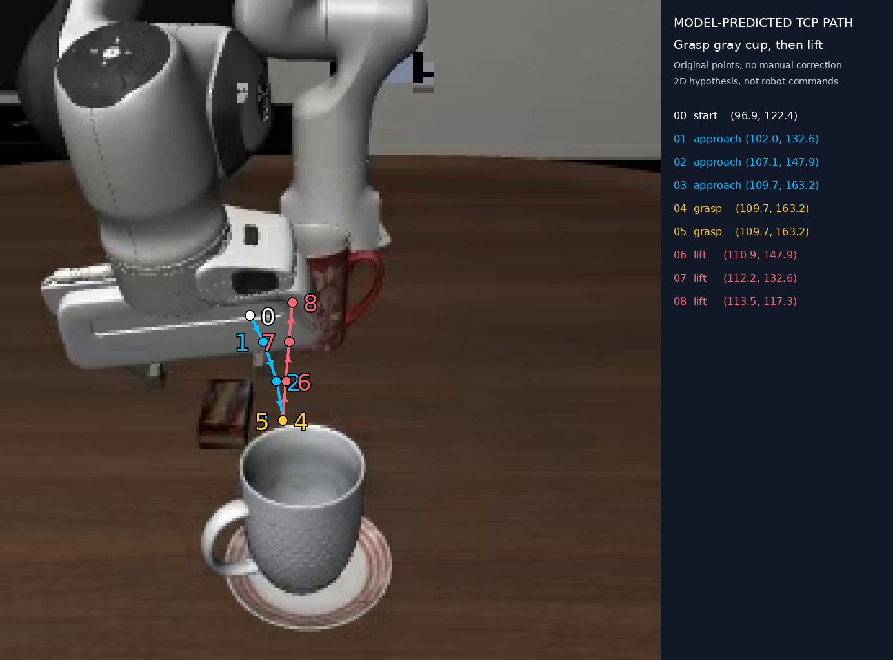

# 灰色杯子抓取与抬起：首次实测

输入图片：`examples/long_task01_ep0001.png`（256×256）。任务、提示词、图片在两次推理中相同。模型为 `Qwen/Qwen3.8-27B`，BF16，无量化，单张 RTX PRO 6000 Blackwell 96GB。

| 设置 | 点数 | 生成耗时 | 输出 token | 峰值 allocated 显存 | 严格提示词格式 |
|---|---:|---:|---:|---:|---|
| [思考模式](cup_lift_bf16/trajectory.json) | 9 | 72.12 秒 | 1475 | 51.38 GiB | 未通过：第 5 点 grasp/closed |
| [非思考模式](cup_lift_bf16_no_thinking/trajectory.json) | 9 | 34.27 秒 | 719 | 51.38 GiB | 未通过：第 5 点 grasp/closed |

计时为模型生成阶段，包含图像预填充，不含权重加载。Transformers 使用 SDPA 及线性注意力/卷积的 PyTorch 参考实现，未安装其可选加速内核；这些数字不代表优化部署的吞吐率。两次均使用 greedy decoding，不能由一个样例推断模型整体能力。

## 思考模式：原始预测

从叠加图观察，起点约 `(144.3,139.5)`，偏离可见夹爪指尖区域；抓取点约 `(119.8,142.8)`，落在杯口上方。接近阶段还出现先向下再向上的折返。该结果是已成功获取和可视化的模型预测，不能称为正确的抓取轨迹。

## 非思考模式：原始预测

路径按接近、闭合、抬起排列，比本次思考模式更连贯。起点约 `(96.9,122.4)` 落在夹爪外壳附近；抓取点约 `(109.7,163.2)` 在杯口上缘附近。没有真实 TCP 标注、深度或执行结果，未量化定位误差，也未验证抓取可行性。

## 格式校验和结果完整性

两次输出都有在 grasp 阶段先 `close` 再 `closed` 的状态。这可解释为关闭后的保持，但未严格遵循提示词规定的 grasp 阶段只能 `close`。`schema_validation.json` 如实记录格式不通过，不将此项误当成坐标或物理执行评价。

第一次推理被初版严格校验拦下，因此仍保留 `validation_error.txt`。随后只调整后处理程序，允许展示结构正确、数值合法但存在夹爪状态约定差异的预测；没有重写坐标或修改原回复。两个目录中的 `trajectory.json` 均与各自原始回复里的最终 JSON 完全一致。

原始 256×256 叠加图为 `overlay.png`；展示图采用最近邻放大，未使用生成式图像模型。只有点、连线、箭头、编号和侧栏由程序绘制。

## 实验记录

- `prompt.txt`：无示范坐标、无人工标注的提示词。
- `raw_response.txt` / `response.txt`：模型原始回复。
- `trajectory.json`：模型给出的结构化点。
- `pixel_waypoints.json`：按原图尺寸换算的像素坐标。
- `metadata.json`：模型 revision、图片 SHA256、软件版本、参数和运行统计。
- `schema_validation.json`：严格格式校验与可绘制性分别记录。

此结果表明整个推理与绘图流程已经跑通，同时暴露出单图 TCP 定位和抓取点预测的偏差。下一步可以独立测试当前 TCP 定位与杯子定位，先区分感知误差和轨迹规划误差。
